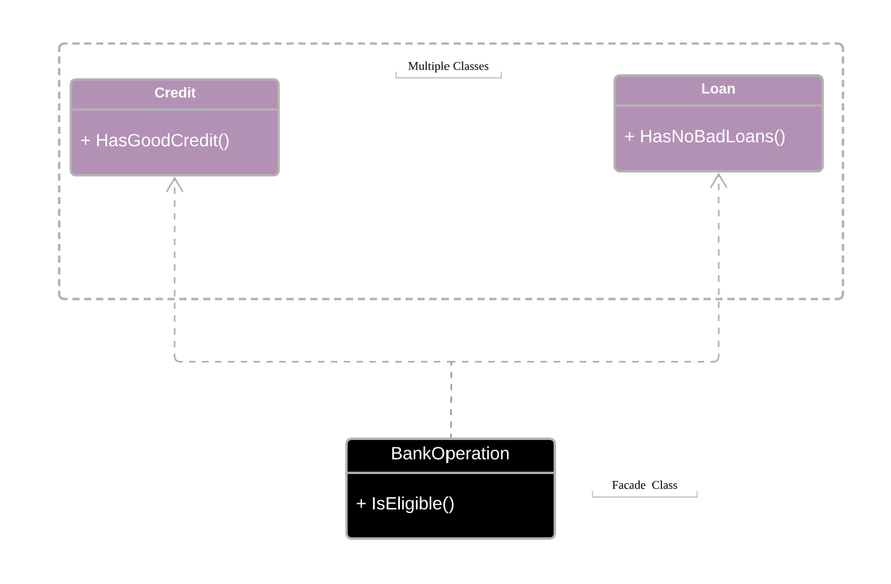
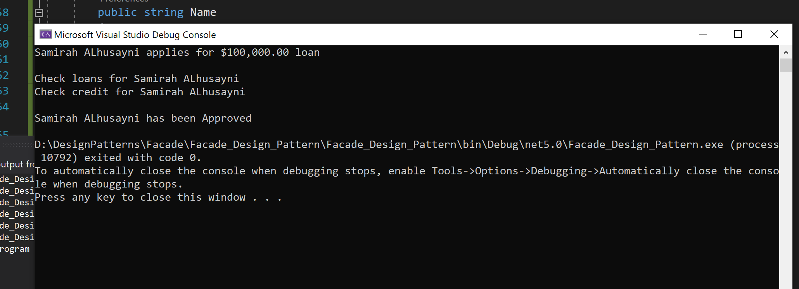

----

 

# Facade Pattern
The facade pattern is a stuctural design pattern that is used to simplify access to functionality in complex designed subsystems. 

 

## Example
One example use of the facade pattern is for Bank System shows only interface and hides all implmentation details. Bank system perform various operation but user can't see the what code written behind the interface.

 

## UML 

## Output 

 

## By:

- Samirah Alhusayni

